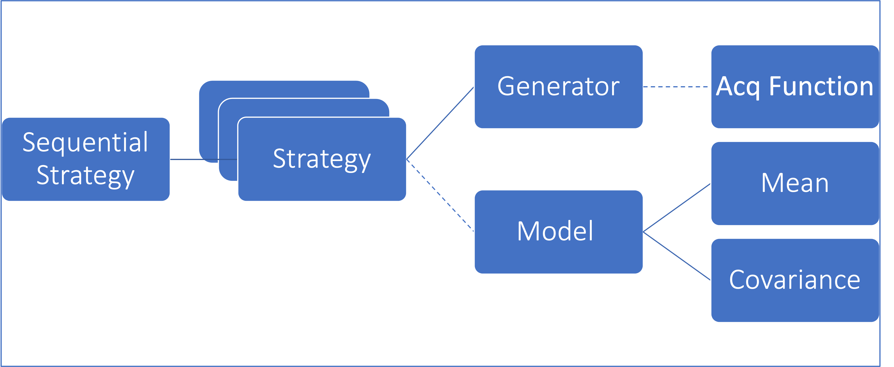

The structure of the AEPsych API can be seen in the following diagram, where each component corresponds to a Python class:

Below is an overview of what each class does. For more details, see the [API Reference](/api).

- **AEPsychStrategy**: The AEPsychStrategy carrys out an experiment with a generation strategy using AxClient object for communicating with the Ax/AEPsych server and a GenerationStrategy object for defining the steps in the experiment. It catches strategies from configure files and call the AxClient to create experiment. It has methods for defining the experiment, generating new points for evaluation, adding data for completed trials, checking if the experiment is finished, and plotting the results. The class also has a method for handling the scenario where the outcome of the experiment is not continuous, and the user will be warned that they cannot directly plot the outcome.

- **AxClient**: The AxClient class serves as a convenience handler for managing experimentation cycles. It acts as a service-like API, where an external system schedules the cycle and makes calls to the client for the next suggestion in the experiment and to log back the evaluation data for that suggestion. The class allows for customization of the generation strategy, database settings, sequential optimization enforcement, random seed, torch device, logging verbosity, and early/global stopping strategies. The AxClient is designed to only propose one arm per trial, with support for batch use cases coming soon. The class is powered by the Union of multiple custom types such as TParamValue and TParameterization for convenience.

- **Experiment**: The make_experiment function creates an instance of an Experiment in the Ax library, which is a tool for optimizing and analyzing the results of machine learning models and other algorithms. The function allows for the definition of the search space for the experiment, including the parameters and their bounds, and the definition of the objective or objectives to optimize. Additionally, constraints on the parameters and outcomes can be specified, as well as various other settings such as the type of the experiment and tracking metrics. The function returns an instance of the Experiment class, which can be used to perform experiments and analyze the results.

- **GenerationStrategy**: The GenerationStrategy class describes the strategy for selecting a model to generate new points for trials in an optimization process. The strategy is defined by a list of GenerationStep objects, which describe which model to use and the number of trials to generate using that model. The strategy can also be given a name, and the name is generated by default by concatenating the names of the models used in the steps. The class has properties and methods to track the current step in the strategy, the model transitions between steps, and the model currently in use. Additionally, it provides logging and error handling for invalid input.

- **AxSobolGenerator(Wrapper for Ax.Models.SOBOL)**: AxSobolGenerator is a generation step class that generates points using SobolGenerator. The get_config_options method returns the options necessary to configure the SobolGenerator.

- **AxOptimizeAcqfGenerator(Wrapper for Ax.Models.BOTORCH_MODULAR**: The AxOptimizeAcqfGenerator class is a class for generating acquisition functions in the context of model-based optimization. It is a subclass of the AEPsychGenerationStep and ConfigurableMixin classes and provides the functionality to generate next samples using the optimization of an acquisition function. The class provides a get_config_options() method for retrieving the configuration options for this class from a Config object, including options for the model, acquisition function, and acquisition function generator. The options for the model include information about the surrogate model to be used, the acquisition class, and the specific acquisition function to use. The options for the acquisition function include any necessary arguments for the acquisition function. The options for the acquisition function generator include the number of restarts and the number of samples to be used.

- **AEPsychSurrogate(Model options)**: The AEPsychSurrogate class is a subclass of the Surrogate class. It is a machine learning model used to make predictions about outcomes based on input data. The AEPsychSurrogate class is specifically designed to model data in the context of a psychological study, and its main purpose is to perform regression over the input data and make predictions about outcomes based on that data. The fit method is called to perform the regression and train the model. 

- **[AEPsychAcquistion(Acquisition Options)](/api/acquisition)**: The Acquisition class is a wrapper for the BoTorch AcquisitionFunction. It is meant to be used as a subcomponent of the BoTorchModel. The class takes as input a surrogate model, metadata about the search space, optimization arguments, and the type of BoTorch AcquisitionFunction to be used. The class stores information such as the surrogate model, the acquisition function, objective weights, and outcome constraints. The class also subsets the model to include only the outcomes needed for optimization. If multiple objectives are present, the class will also infer the objective thresholds using the model.

You may implement an AEPsych experiment using these classes directly in Python, but users who are not familiar with Python can also configure an AEPsych server using a config file.
