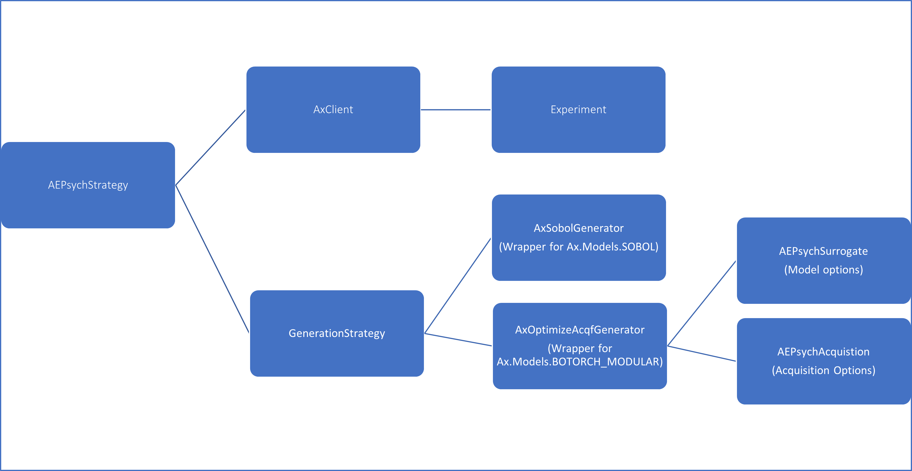

The structure of the AEPsych API can be seen in the following diagram, where each component corresponds to a Python class:



- **[AEPsychStrategy](../aepsych/strategy.py#L500)**: The AEPsychStrategy carrys out an experiment with a generation strategy using AxClient object for communicating with the Ax/AEPsych server and a GenerationStrategy object for defining the steps in the experiment. It reads strategies from configurarion files and call the AxClient to create experiment. It has methods for defining the experiment, generating new points for evaluation, adding data for completed trials, checking if the experiment is finished, and plotting the results. The class also has a method for handling the scenario where the outcome of the experiment is not continuous, and the user will be warned that they cannot directly plot the outcome.

    - Init Args:
        - `strategy`: The `GenerationStragegy` to use.
        - `ax_client`: the configured `AxClient` to use.

- **[AxClient](https://github.com/facebook/Ax/blob/main/ax/service/ax_client.py#L108)**: The AxClient class serves as a convenience handler for managing experimentation cycles. It acts as a service-like API, where an external system schedules the cycle and makes calls to the client for the next suggestion in the experiment and to log back the evaluation data for that suggestion. The class allows for customization of the generation strategy, database settings, sequential optimization enforcement, random seed, torch device, logging verbosity, and early/global stopping strategies. The AxClient is designed to only propose one arm per trial, with support for batch use cases coming soon. The class is powered by the Union of multiple custom types such as TParamValue and TParameterization for convenience.

    - Init Args:
        - `generation_strategy`: Optional generation strategy. If not set, one is intelligently chosen based on properties of search space.
        - `db_settings`: Settings for saving and reloading the underlying experiment to a database. Expected to be of type
        - `enforce_sequential_optimization`: Whether to enforce that when it is reasonable to switch models during the optimization (as prescribed
            by `num_trials` in generation strategy), Ax will wait for enough trials to be completed with data to proceed. 
        - `random_seed`: Optional integer random seed, set to fix the optimization
            random seed for reproducibility.
        - `torch_device`: An optional `torch.device` object, used to choose the device used for generating new points for trials.
        - `verbose_logging`: Whether Ax should log significant optimization events, defaults to `True`.
        - `suppress_storage_errors`: Whether to suppress SQL storage-related errors if encounted. 
        - `early_stopping_strategy`: A `BaseEarlyStoppingStrategy` that determines whether a trial should be stopped given the current state of
            the experiment. Used in `should_stop_trials_early`.
        - `global_stopping_strategy`: A `BaseGlobalStoppingStrategy` that determines whether the full optimization should be stopped or not.
    
- **[GenerationStrategy](https://github.com/facebook/Ax/blob/main/ax/modelbridge/generation_strategy.py#L46)**: The GenerationStrategy class describes the strategy for selecting a model to generate new points for trials in an optimization process. The strategy is defined by a list of GenerationStep objects, which describes which model to use and the number of trials to generate using that model. The strategy can also be given a name, and the name is generated by default by concatenating the names of the models used in the steps. The class has properties and methods to track the current step in the strategy, the model transitions between steps, and the model currently in use. Additionally, it provides logging and error handling for invalid input.
    - Init Args:
        - `steps`: A list of `GenerationStep` describing steps of this strategy.
        - `name`: An optional name for this generaiton strategy.
    - Config File Args:
        ```
            strategy_names = [init_strat, opt_strat] # The strategies that will be used, corresponding to the named sections below
    
            [init_strat]
            generator = SobolGenerator # Start trial generation with sobol samples.
            min_total_tells = 2
    
            [opt_strat]
            generator = OptimizeAcqfGenerator # after sobol, do model-based active-learning
            min_total_tells = 3
            acqf = qNoisyExpectedImprovement # The acquisition function to be used with the model. We recommend qNoisyExpectedImprovement for optimization problems.
            model = ContinuousRegressionGP # Basic model for continuous outcomes.
        ```

- **[Experiment](https://github.com/facebook/Ax/blob/main/ax/core/experiment.py#L59)**: An Experiment defines the entire set of parameter objects, and parameter constraints of the parameter space, through the `SearchSpace`. The make_experiment function creates an instance of an Experiment in the Ax library, which is a tool for optimizing and analyzing the results of machine learning models and other algorithms. The function allows for the definition of the search space for the experiment, including the parameters and their bounds, and the definition of the objective or objectives to optimize. Additionally, constraints on the outcomes can be specified, as well as various other settings such as the type of the experiment and tracking metrics. The function returns an instance of the Experiment class, which can be used to perform experiments and analyze the results.

    - Init Args:
        - `search_space`: Search space of the experiment.
        - `name`: Name of the experiment.
        - `optimization_config`: Optimization config of the experiment.
        - `tracking_metrics`: Additional tracking metrics not used for optimization.
        - `runner`: Default runner used for trials on this experiment.
        - `status_quo`: Arm representing existing "control" arm.
        - `description`: Description of the experiment.
        - `is_test`: Convenience metadata tracker for the user to mark test experiments.
        - `experiment_type`: The class of experiments this one belongs to.
        - `properties`: Dictionary of this experiment's properties.
        - `default_data_type`: Enum representing the data type this experiment uses.
    - Config File Args:
        ```       
            [common]
            use_ax = True
            
            stimuli_per_trial = 1 # The number of stimuli shown in each trial; currently the Ax backend only supports 1
            outcome_types = [continuous] # The type of response given by the participant; can be [binary] or [continuous].
    
            parnames = [par1, par2, par3] # Names of continuous parameters.
            lb = [0, 0, 1] # Lower bounds of the continuous parameters, in the same order as above.
            ub = [10, 10, 100]
            choice_parnames = [par4, par5]
            fixed_parnames = [par6, par7]
        ```
         
- **[AxSobolGenerator](../aepsych/generators/sobol_generator.py#L93)**: AxSobolGenerator is a generation step class that generates points using SobolGenerator. This Generator generates quasi-random low discrepancy eperimentation points for the parameter space. The get_config_options method returns the options necessary to configure the SobolGenerator.
    - Config File Args:
    ```
            [sobol_strat]
            generator = SobolGenerator # points will be generated from Sobol sequence
            min_total_tells = 5 # next strategy will start after at least 5 responses are recorded
    ```

- **AxOptimizeAcqfGenerator(Wrapper for Ax.Models.BOTORCH_MODULAR**:  It is a subclass of the AEPsychGenerationStep and ConfigurableMixin classes and provides the functionality to generate next samples using the optimization of an acquisition function. The class provides a get_config_options() method for retrieving the configuration options for this class from a Config object, including options for the model, acquisition function, and acquisition function generator.                     


- **[AxOptimizeAcqfGenerator](../aepsych/generators/optimize_acqf_generator.py#L182)**: The AxOptimizeAcqfGenerator generates acquisition functions in the context of model-based optimization. It is a wrapper for Ax's BOTORCH_MODULAR, consisting of two main components, the AEPsychSurrogate and the AEPsychAcquisitionFunction. It aims to abstract away the interfaces between AEPsych, Ax and Botorch. The options for the model include information about the surrogate model to be used, and the specific acquisition function to use. The options for the acquisition function generator include the number of trials and the duration of usage.      
    - Config File Args:
    ```
            [opt_strat]
            generator = OptimizeAcqfGenerator
            model = GPClassificationModel
            acqf = qNoisyExpectedImprovement
            min_total_tells = 100
        
            # Configuration for the model
            [ContinuousRegressionGP]
            max_fit_time = 0.1
    ```

- **[AEPsychSurrogate](../aepsych/models/surrogate.py#L18)**: It is a machine learning model used to make predictions about outcomes based on input data. It uses the collected data to compute the response probabilities at any point in the parameter space. This is wrapper arround BoTorch's Model class, it determines what model to use, its options, its max_fit_time, and its model class. 

    - Init Args:
        - `max_fit_time`: Optional field that sets an estimated maximum amount of time for the evaluation of all samples
        - `botorch_model_class`: `Model` class to be used as the underlying BoTorch model.
        - `model_options`: Dictionary of options / kwargs for the BoTorch `Model` constructed during `Surrogate.fit`.
        - `mll_class`: `MarginalLogLikelihood` class to use for model-fitting.
        - `mll_options`: Dictionary of options / kwargs for the MLL.
        - `outcome_transform`: BoTorch outcome transforms. Passed down to the BoTorch `Model`. Multiple outcome transforms can be chained
            together using `ChainedOutcomeTransform`.
        - `input_transform`: BoTorch input transforms. Passed down to the BoTorch `Model`. Multiple input transforms can be chained
            together using `ChainedInputTransform`.
        <!-- - `covar_module_class`: Covariance module class, not yet used. Will be used to construct custom BoTorch `Model` in the future.
        - `covar_module_options`: Covariance module kwargs, not yet used. Will be used to construct custom BoTorch `Model` in the future.
        - `likelihood`: `Likelihood` class, not yet used. Will be used to construct custom BoTorch `Model` in the future.
        - `likelihood_options`: Likelihood options, not yet used. Will be used to construct custom BoTorch `Model` in the future. -->

    - Config File Args:
    ```
            [opt_strat]
            generator = OptimizeAcqfGenerator
            model = GPClassificationModel
    ```

- **[AEPsychAcquisition](../aepsych/acquisition/acquisition.py#L15)**: Acquisition functions use the strategy's model to determine which points should be sampled next, with some overarching goal in mind. We recommend PairwiseMCPosteriorVariance for global exploration, and qNoisyExpectedImprovement for optimization. For other options, check out the botorch and aepsych docs. The class also subsets the model to include only the outcomes needed for optimization. If multiple objectives are present, the class will also infer the objective thresholds using the model.
    - Config File Args:
    ```
            [opt_strat]
            generator = OptimizeAcqfGenerator
            model = GPClassificationModel
            acqf = qNoisyExpectedImprovement
    ```


You may implement an AEPsych experiment using these classes directly in Python, but users who are not familiar with Python can also configure an AEPsych server using a config file.
