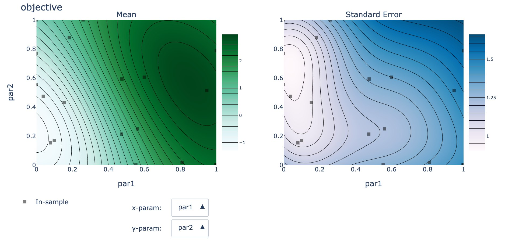
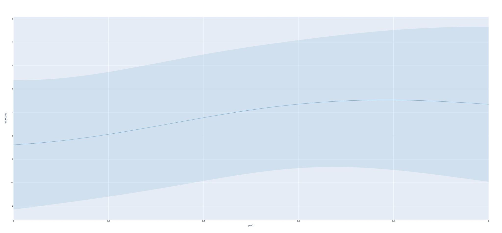

This page explains the features enabled by using the [Ax](https://ax.dev/) backend for AEPsych. This page follows the [example Ax config file](https://github.com/facebookresearch/aepsych/blob/main/configs/ax_example.ini). If you are not already familiar with AEPsych config files, you may wish to read [this page on basic config files](https://aepsych.org/docs/configs) and [this page on advanced config files](https://aepsych.org/docs/finish_criteria) first. To enable Ax features in AEPsych, you must specify `use_ax = True` under the `[common]` section of your config file. Note that while most of settings remain the same when using the Ax backend, the names of the models have changed. You should use `ContinuousRegressionGP` instead of `GPRegressionModel` and `BinaryClassificationGP` instead of `GPClassificationModel`.

## Parameter Constraints
Ax enables AEPsych to support linear parameter constraints using the par_constraints setting under common. These constraints take the form of a list of strings like `a*par1 + b*par2 <= c`. In the example config we have `par_constraints = [par1 >= par2]` to specify that the the first parameter must be greater than or equal to the second. We could add additional constraints such as
`par_constraints = [par1 >= par2, 2*par - par3 <= 0]`
but be aware that the more constraints you have, and the more complex those constraints are, the slower it will be to generate trials.

## Discrete Choice Parameters & Fixed Parameters
Parameters can now take discrete values instead of just continuous ones. To specify discrete choice parameters, you will first need to list the names of the parameters under the common section, as in the following taken from the example config:
```
[common]
choice_parnames = [par4, par5]
```
You then need to specify sections for each of the parameters that list the possible values they can take, like so:
```
[par4]
choices = [a, b]

[par5]
choices = [low, med, high]
is_ordered = True
```

Note that the values of the discrete choice parameters should be strings. The `is_ordered = True` setting under `par5` indicates that the choices are ordered from lowest to highest (low < med < high). This setting should always be specified when possible because it simplifies the underlying model, yielding more accurate results and faster trials. If this setting is not specified, no ordering between values is assumed.
In a similar matter, you can also specify parameters that always take the same fixed values. For instance, the following specifies that `par6` and `par7` will always take the values `123`, and `"placeholder"`, respectively (fixed parameters can be either floats or strings).
```
[common]
fixed_parnames = [par6, par7]

[par6]
value = 123

[par7]
value = placeholder
```

## Integer & Log-scaled Parameters
This update also enables new options for continuous parameters. You can now specify that a parameter should be an integer (rather than a float, by default) or you can specify that a parameter should be log-scaled, like so:
```
[common]
parnames = [par1, par2, par3, par4]
lb = [0, 0, 0, 1]
ub = [10, 10, 10, 100]

[par1]
value_type = int

[par4]
log_scale = True
```

In this example, `par1` will always take an integer value from 0 to 10, and `par4` will be explored in log space from 1 to 100. This setting is useful when percentage increases are more impactful than absolute increases (i.e., the difference between 1 and 2--a 100% increase--is more important the difference between 10 and 11--a 10% increase). This setting should also be set to `True` when appropriate because it will help the model more efficiently explore the parameter space. Note, though, that log-scaled parameters cannot be used with parameter constraints because log-scaling is a nonlinear transformation.

## Interactive Plots
Another new feature enabled by this Ax integration is that we can make use of interactive Ax plots. Plots like the one below can be created by calling `server.strat.plot_contours()`. The plot shows both the mean and standard error of the predicted values throughout the parameter space. You can see the exact values at collected data points by hovering over them with the cursor, and you can select which parameters are plotted using the drop-down menus. You can fix the values of the un-plotted parameters by passing in a dictionary like `server.strat.plot_contours(slice_values={"par3": 0.5})`.



Similarly, you can plot slices of single parameters using `server.strat.plot_contours(param_name="par1", slice_values={"par2": 1.0, "par3": 0.5})`.



## AEPsych Features Currently Incompatible with Ax

Rewriting AEPsych to be compatible with Ax was a huge undertaking, so not all of the old AEPsych features could be converted right away. As of right now, the following features do not currently work with the Ax backend:
- Plotting non-continuous outcomes (can still plot latent function)
- Pairwise experiments
- Setting a maximum generation time (trials may be slow w/o this)
- Warm-start refitting (trials may be slow w/o this)
- Using a model with Sobol sampling (useful for pure exploration, among other things)
- Monotonicity constraints
- Ordinal/Likert outcomes
- Manually specifying points to sample via ManualGenerator (can still be done on the client side)

All of these features should still work as long you do not specify `use_ax = True` in your config file. We plan on gradually implementing some of these features, and many of which will be more powerful with the Ax backend.
