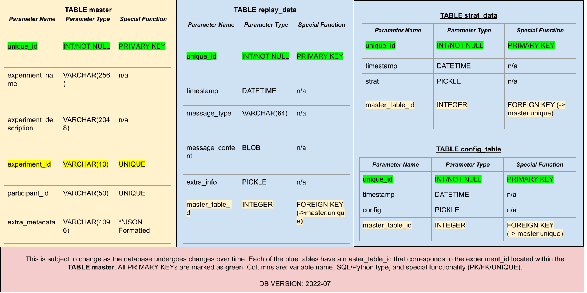

The database is an important component in an AEPsych project. It stores experiment metadata and also includes each message passed between the client and server, allowing previous experiments to be replayed trial-by-trial. The database is built using [SQL Alchemy](https://www.sqlalchemy.org/). The entire structure of the AEPsych Database implementation can be seen below in the following diagram:

In this diagram, the primary table is in yellow with all child tables in blue. The green-highlighted text represents the unique ID entry for that specific table. The yellow-highlighted text corresponds to a foreign key in the primary (yellow) table.

The database contains four tables: one primary and three secondary tables. Each table is described as follows:

- **master Table**: This table is the primary table of AEPsych. This table stores information about each experiment and is used to link data stored in the other tables. The columns are described as followed:

|Master Table Column | Purpose|
|:-: | :- |
|unique_id | A unique ID generated for each entry in this table.|
|experiment_name | A name given to the experiment through the experiment's configuration file. If not specified, defaults to "default name".|
|experiment_description | A text description of the experiment. This value is configurable in the experiment's configuration file. If not specified, defaults to "default description".|
|experiment_id | A unique ID for an experiment. If not specified in the experiment's configuration file, it will be automatically generated through the Python's [Unique Universal Identifier](https://docs.python.org/3/library/uuid.html) module.|
|participant_id | A unique ID for a specific participant in an experiment. If not specified in the experiment's configuration file, it will be left empty.|
|extra_metadata | Any special metadata specified in the configuration file under the section "Metadata". This metadata is stored as JSON so that it may be easily serialized/deserialized at a later time period. If no metadata is specified in the configuration file, this field will be empty. |

- **replay_data Table**: The replay table contains the messages sent between the client and the server on each trial so that previous experiments can be replayed again. The columns are described as followed:

|Replay Data Column | Purpose |
|:-: | :- |
|unique_id | A unique ID generated for each entry in this table. |
|timestamp | A timestamp indicating when the server sent or received a message. This column can be used to view messages in chronological order. |
|message_type | The type of message. These message types include _setup_, _ask_, and _tell_, among others.|
|message_contents | Contains the raw data in the message_content field of the message. This is stored as a BLOB in the database (This may be changed to JSON in the future). |
|extra_info | Extra information pertaining to the replay data. This is stored as a Python pickle object for serialization/deserialization (This may change in the future as Python pickle objects may not load across versions of Python or AEPsych). |
|master_table_id | A reference key to the original entry in the master table's unique ID. |

- **strat_data table**: The strat_data table stores the saved AEPsych Strategies, which contain the experiments' data and models. The columns are described as followed:

|Strat Table Column | Purpose |
| :-: | :- |
|unique_id | A unique ID generated for each entry in this table. |
|timestamp | A timestamp indicating when a strategy was saved to the database, either because it finished or the server crashed. This column can be used to view the strategies chronologically. |
|strat| An AEPsych Strategy object, stored as a Python pickle for easy serialization/deserialization (This may change in the future as Python pickle objects may not load across versions of Python or AEPsych).  |
|master_table_id| A reference key to the original entry in the master table's unique ID.|

- **config Table**: This table stores saved AEPsych Configs, which store configuration data for each experiment, such as the number of trials, the type of data collected, the models used, etc. The columns are described as followed:

|Config Table Column | Purpose |
|:-: | :- |
|unique_id | A unique ID generated for each entry in this table. |
|timestamp | A timestamp indicating when the server received a setup message and created a Config object. This column can be used to view the Configs chronologically. |
|config| An AEPsych Config object, stored as a Python pickle for easy serialization/deserialization.  (This may change in the future as Python pickle objects may not load across versions of Python or AEPsych). |
|master_table_id| This is a reference key to the original entry in the master table's unique ID.

The database schema is constantly evolving, so you may occasionally need to update old databases by running `python3 aepsych/server/server.py database --update --d database_path` from a command line. For more information about loading data and replaying previous experiments, see the [example database and notebook](https://github.com/facebookresearch/aepsych/tree/main/tutorials/example_db).
