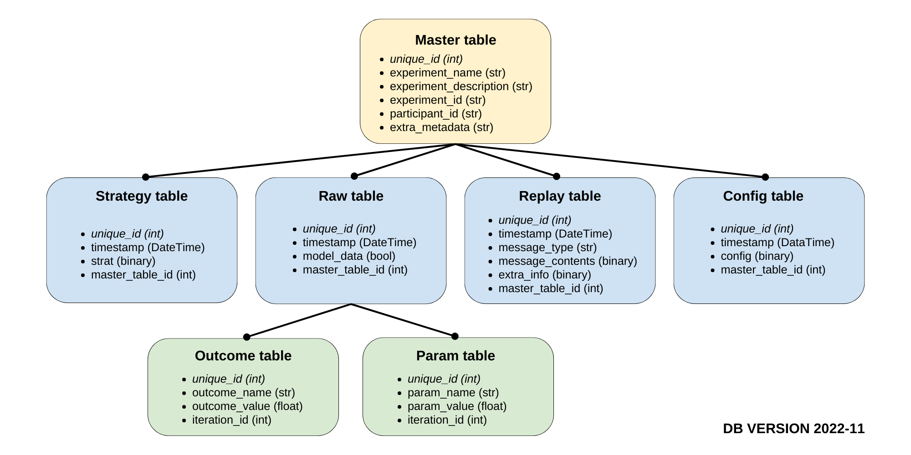

The database is an essential component in an AEPsych project. It stores experiment metadata and also includes each message passed between the client and server, allowing previous experiments to be replayed trial-by-trial. The database is built using [SQL Alchemy](https://www.sqlalchemy.org/). The entire structure of the AEPsych Database implementation can be seen below in the following diagram:


In this diagram, the primary table is in yellow, with all child tables in blue. The green-highlighted text represents the unique ID entry for that specific table. The yellow-highlighted text corresponds to a foreign key in the primary (yellow) table.

The raw_data Table is a fact table with two dimension child tables (in green). Again, the green-highlighted text represents the unique ID entry for that specific Table. The yellow-highlighted text corresponds to a foreign key in the fact (blue) table.

The database contains seven tables: one primary table with four secondary child tables. One of those is a fact table, with another two children. The tables' relationships can be seen in the following diagram:



Each table is described as follows:

- **master Table**: This table is the primary table of AEPsych. This table stores information about each experiment and is used to link data stored in the other tables. The columns are described as follows:


|Master Table Column | Purpose|
|:-: | :- |
|unique_id | A unique ID generated for each entry in this table.|
|experiment_name | A name given to the experiment through the experiment's configuration file. If not specified, defaults to "default name".|
|experiment_description | A text description of the experiment. This value is configurable in the experiment's configuration file. If not specified, defaults to "default description".|
|experiment_id | An ID for an experiment. If not specified in the experiment's configuration file, it will be automatically generated through Python's [Unique Universal Identifier](https://docs.python.org/3/library/uuid.html) module.|
|participant_id | A ID for a specific participant in an experiment. If not specified in the experiment's configuration file, it will be another generated UUID as in experiment_id.|
|extra_metadata | Any special metadata specified in the configuration file under the section "Metadata". This metadata is stored as JSON so that it may be easily serialized/deserialized at a later time period. If no metadata is specified in the configuration file, this field will be empty, keys set as distinct columns in this table will not be duplicated here. |


- **replay_data Table**: The replay table contains the messages sent between the client and the server on each trial so that previous experiments can be replayed again. The columns are described as follows:

|Replay Data Column | Purpose |
|:-: | :- |
|unique_id | A unique ID generated for each entry in this table. |
|timestamp | A timestamp indicating when the server sent or received a message. This column can be used to view messages in chronological order. |
|message_type | The type of message. These message types include _setup_, _ask_, and _tell_, among others.|
|message_contents | Contains the raw data in the message_content field of the message. This is stored as a BLOB in the database (This may be changed to JSON in the future). |
|extra_info | Extra information pertaining to the replay data. This is stored as a Python pickle object for serialization/deserialization (This may change in the future as Python pickle objects may not load across versions of Python or AEPsych). |
|master_table_id | A reference key to the original entry in the master table's unique ID. |

- **strat_data table**: The strat_data table stores the saved AEPsych Strategies, which contain the experiments' data and models. The columns are described as follows:

|Strat Table Column | Purpose |
| :-: | :- |
|unique_id | A unique ID generated for each entry in this table. |
|timestamp | A timestamp indicating when a strategy was saved to the database, either because it finished or the server crashed. This column can be used to view the strategies chronologically. |
|strat| An AEPsych Strategy object, stored as a Python pickle for easy serialization/deserialization (This may change in the future as Python pickle objects may not load across versions of Python or AEPsych).  |
|master_table_id| A reference key to the original entry in the master table's unique ID.|

- **config Table**: This table stores saved AEPsych Configs, which store configuration data for each experiment, such as the number of trials, the type of data collected, the models used, etc. The columns are described as follows:

|Config Table Column | Purpose |
|:-: | :- |
|unique_id | A unique ID generated for each entry in this table. |
|timestamp | A timestamp indicating when the server received a setup message and created a Config object. This column can be used to view the Configs chronologically. |
|config| An AEPsych Config object, stored as a Python pickle for easy serialization/deserialization. (This may change in the future as Python pickle objects may not load across versions of Python or AEPsych). |
|master_table_id| This is a reference key to the original entry in the master table's unique ID.

- **Raw Table**: Fact table to store raw data for each iteration of a given experiment. It has two associated dimension tables, one for the parameters and one for the outcomes. The columns are described as followed:

|Raw Table Column | Purpose |
|:-: | :- |
| unique_id | A unique ID generated for each entry in this table. |
| timestamp | A timestamp indicating when the server received a tell message, and recorded the data of one iteration of a given experiment.|
| master_table_id | This is a reference key to the original entry in the master table's unique ID. |
| parameter_id | This is a reference key to the original entry in the parameter table's unique ID. |
| model_data | Wheter or not the data from that iteration was modeled during the experiment.|

- **Param table**: Dimension table to store the parameters for each iteration of a given experiment. This table stores the parameters' names and values. The columns are described as follows:

|Param Table Column | Purpose |
|:-: | :- |
| unique_id | A unique ID generated for each entry in this table. |
| iteration_id | This is a reference key to the original entry in the raw table's unique ID. |
| parameter_name | The name of the parameter. |
| parameter_value | The value of the parameter. |

- **Outcome table**: Dimension table to store the outcomes for each iteration of a given experiment. This table only stores the outcome values. The columns are described as follows:

|Outcome Table Column | Purpose |
|:-: | :- |
| unique_id | A unique ID generated for each entry in this table. |
| iteration_id | This is a reference key to the original entry in the raw table's unique ID. |
| outcome_value | The value of the outcome. |
| outcome_name | The name of the outcome. The name is generated automatically by AEPsych; it's not given by the user. |

The database schema is constantly evolving, so you may occasionally need to update old databases by running `python3 aepsych/server/server.py database --update --d database_path` from a command line. For more information about loading data and replaying previous experiments, see the [example database and notebook](https://github.com/facebookresearch/aepsych/tree/main/example_db).

## Getting data out from the database.

With SQL queries, you can access the data in any AEPsych database without needing to use AEPsych. You can execute queries with SQLAlchemy in Python:

```Python
from sqlalchemy import create_engine

engine = create_engine(f"sqlite:///{'database.db'}")

engine.execute("some query").fetchall()
```

### Data from a given experiment.
Let's consider that you have the database "example.db", and you want to get all the data from a specific experiment. There is a unique `experiment_id` associated with each experiment stored in the database. You can see the experiments' names and information with the following query:

```SQL
SELECT * FROM master
```

If we want to obtain all the parameters' information from an experiment with ID `6dcb1a77-5590-4e30-a740-21fe7bc43357`, we can get it with:

```SQL
SELECT iteration_id, param_name, param_value FROM param_data
WHERE iteration_id IN (SELECT unique_id FROM raw_data WHERE master_table_id = (
    SELECT unique_id FROM master WHERE experiment_id = '6dcb1a77-5590-4e30-a740-21fe7bc43357'
)) ORDER BY iteration_id
```

And the outcomes' information with:

```SQL
SELECT iteration_id, outcome_name, outcome_value FROM outcome_data
WHERE iteration_id IN
(SELECT unique_id FROM raw_data WHERE master_table_id =
    (SELECT unique_id FROM master WHERE experiment_id = '6dcb1a77-5590-4e30-a740-21fe7bc43357')
) ORDER BY iteration_id
```

These queries give us long-format tables (several rows per experiment iteration). You must know the parameters and outcomes names to get a wide-format table (a single row per iteration). For example, if you have parameters `theta1`, `theta2` and a single outcome `outcome`, then:

```SQL
SELECT iteration_id,
    MAX(CASE WHEN param_name = 'theta1' THEN param_value ELSE NULL END) AS theta1,
    MAX(CASE WHEN param_name = 'theta2' THEN param_value ELSE NULL END) AS theta2,
    MAX(CASE WHEN outcome_name = 'outcome' THEN outcome_value ELSE NULL END) AS outcome
FROM
(
    SELECT od.iteration_id AS iteration_id,
    param_name, param_value, outcome_name, outcome_value
    FROM param_data AS pd
    INNER JOIN outcome_data AS od
    ON pd.iteration_id = od.iteration_id
    WHERE pd.iteration_id IN
    (SELECT unique_id FROM raw_data WHERE master_table_id = (
       SELECT unique_id FROM master
       WHERE experiment_id = '6dcb1a77-5590-4e30-a740-21fe7bc43357')
    )
) GROUP BY iteration_id ORDER BY iteration_id
```

You can also create a wide-format table for any set of parameters and outcomes (not previously specified) with Pandas:

```Python
from sqlalchemy import create_engine
import pandas as pd

engine = create_engine(f"sqlite:///{'example.db'}")

outcomes = engine.execute('''
    SELECT iteration_id, outcome_name, outcome_value FROM outcome_data
    WHERE iteration_id IN (SELECT unique_id FROM raw_data WHERE master_table_id = (
       SELECT unique_id FROM master WHERE experiment_id = '6dcb1a77-5590-4e30-a740-21fe7bc43357'
    )) ORDER BY iteration_id
''').fetchall()

parameters = engine.execute('''
    SELECT iteration_id, param_name, param_value FROM param_data
    WHERE iteration_id IN (SELECT unique_id FROM raw_data WHERE master_table_id = (
       SELECT unique_id FROM master WHERE experiment_id = '6dcb1a77-5590-4e30-a740-21fe7bc43357'
    )) ORDER BY iteration_id
''').fetchall()

outcomes_df = pd.DataFrame(outcomes, columns=['iteration_id', 'outcome_name', 'outcome_value'])
parameters_df = pd.DataFrame(parameters, columns=['iteration_id', 'param_name', 'param_value'])

outcomes_df = outcomes_df.pivot(index='iteration_id', columns='outcome_name', values='outcome_value')
parameters_df = parameters_df.pivot(index='iteration_id', columns='param_name', values='param_value')

df = pd.merge(outcomes_df, parameters_df, left_index=True, right_index=True)
```

Finally, if you are using AEPsych, you can use the built-in method `generate_experiment_table` in the AEPsych server.

### Data from several experiments with the same set of parameters.

Now, let's think that we want to obtain all the data from experiments with the same set of parameters, for example, `thetaA` and `thetaB`. We can get it with:

```Python
from sqlalchemy import create_engine
import pandas as pd

engine = create_engine(f"sqlite:///{'test_query.db'}")

parameters = engine.execute('''
SELECT iteration_id, param_name, param_value FROM param_data
WHERE iteration_id IN (
    SELECT iteration_id FROM param_data WHERE param_name = 'thetaA'
    AND iteration_id IN (
        SELECT iteration_id FROM param_data WHERE param_name = 'thetaB'
        )
)''').fetchall()
```

Similarly, we can get the outcomes' information with:

```Python
outcomes = engine.execute('''
SELECT iteration_id, outcome_name, outcome_value FROM outcome_data
WHERE iteration_id IN (
    SELECT iteration_id FROM param_data WHERE param_name = 'thetaA'
    AND iteration_id IN (
        SELECT iteration_id FROM param_data WHERE param_name = 'thetaB'
        )
)''').fetchall()
```

Finally, if we want to get a wide-format table that includes the experiments' IDs and the previous parameters and outcomes information, we can do it with something like:

```Python
# Get the relation between the iteration_id and the master_table_id
raws = engine.execute('''
SELECT unique_id, master_table_id FROM raw_data
WHERE unique_id IN (
    SELECT iteration_id FROM param_data WHERE param_name = 'thetaA'
    AND iteration_id IN (
        SELECT iteration_id FROM param_data WHERE param_name = 'thetaB'
        )
)''').fetchall()

# Get the relation between the master_table_id and the experiment_id
exp_ids = engine.execute('''
SELECT unique_id, experiment_id FROM master WHERE unique_id IN (
SELECT DISTINCT master_table_id FROM raw_data
WHERE unique_id IN (
    SELECT iteration_id FROM param_data WHERE param_name = 'thetaA'
    AND iteration_id IN (
        SELECT iteration_id FROM param_data WHERE param_name = 'thetaB'
        )
    )
)''').fetchall()

# Create dataframes
parameters_df = pd.DataFrame(parameters, columns=['iteration_id', 'param_name', 'param_value'])
outcomes_df = pd.DataFrame(outcomes, columns=['iteration_id', 'outcome_name', 'outcome_value'])
raws_df = pd.DataFrame(raws, columns=['unique_id', 'master_table_id'])
raws_df.rename(columns={'unique_id': 'iteration_id'}, inplace=True)
raws_df.set_index('iteration_id', inplace=True)

# Pivot the parameters and outcomes
parameters_df = parameters_df.pivot(index='iteration_id', columns='param_name', values='param_value')
outcomes_df = outcomes_df.pivot(index='iteration_id', columns='outcome_name', values='outcome_value')

# Merge the dataframes
df = pd.merge(parameters_df, outcomes_df, left_index=True, right_index=True)
df = pd.merge(df, raws_df, left_index=True, right_index=True)

# Create experiment_id column
exp_dict = {exp_id: exp for exp_id, exp in exp_ids}
df['experiment_id'] = df['master_table_id'].map(exp_dict)
df.drop(columns=['master_table_id'], inplace=True)
```

We can do something similar to get data from experiments with the same set of outcomes.
