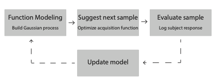

## Installation
`AEPsych` only supports python 3.8+. We recommend installing `AEPsych` under a virtual environment like
[Anaconda](https://docs.conda.io/projects/conda/en/latest/user-guide/tasks/manage-environments.html).
Once you've created a virtual environment for `AEPsych` and activated it, you can install AEPsych from pip:

```
pip install aepsych
```

This installs the core library, as well as our executable `aepsych_server`. For installing clients, see [client documentation](../clients.html).

## The AEPsych experiment flow

Here is the basic overview of how AEPsych works:


First, we initialize a model from a small number of datapoints collected from quasi-random parameter settings. Then:

1. Build a model of the data so far. AEPsych uses Gaussian Process classification models by default, but other models can be used as well if they are API-compatible with AEPsych and differentiable using PyTorch.
2. Using the model to select the next point to observe. AEPsych does this by defining an *acquisition function* that describes the goodness of observing a particular point given the knowledge encoded in the model (for example, the uncertainty in the model's predictions at that point), and then optimizing that function w.r.t. the stimulus configuration.
3. Query the participant for a response. Here AEPsych can interface with PsychoPy, PsychToolbox, or other stimulus presentation code.
4. Go back to 1.
